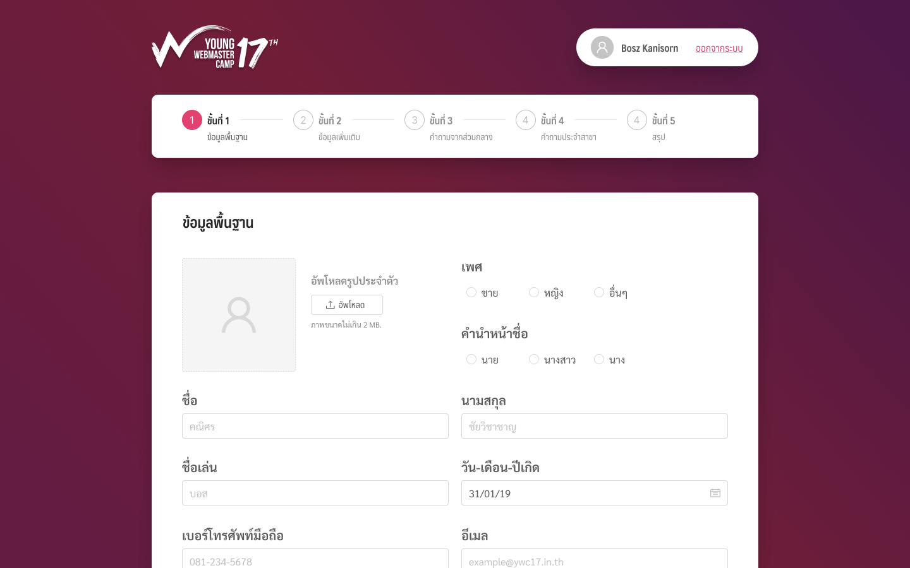

<h1 align="center">17th Young Webmaster Camp - Registration System</h1>

Registration System คือระบบรับสมัครของค่าย Young Webmaster Camp

Link: <a href="https://register.ywc17.ywc.in.th/">https://register.ywc17.ywc.in.th/</a>

 
## Feature

- เข้าสู่ระบบรับสมัครด้วย Facebook
- ใบสมัครแบ่งออกเป็น 5 Step
    1. ข้อมูลส่วนตัว
       เป็นข้อมูลส่วนตัว ที่อยู่ และข้อมูลการศึกษา เพื่อประกอบการสมัครค่าย
    2. ข้อมูลเพิ่มเติม และ เลือกสาขา
       เป็นข้อมูลเพิ่มเติม ข้อมูลติดต่อฉุกเฉิน และเลือกสาขาที่ต้องการสมัคร (ในระบบนี้ หากยืนยันสาขาแล้ว จะไม่สามารถกลับมาแก้ไขได้)
    3. คำถามกลาง
       เป็นคำถามที่ผู้เข้าสมัครทุกคนจะได้เหมือนกัน เพื่อส่งให้กรรมคัดเลือกตรวจเข้ารอบสัมภาษณ์
    4. คำถามสาขา
       เป็นคำถามที่เปลี่ยนไปตามสาขาที่เลือก เพื่อส่งให้กรรมคัดเลือกตรวจเข้ารอบสัมภาษณ์
    5. สรุปข้อมูลใบสมัคร
       เป็นหน้าสรุปข้อมูลข้อมูลใบสมัครที่กรอก
- การตรวจใบสมัครจะถูกตรวจในระบบ <a href="https://bo.ywc.in.th/">Back Office</a>